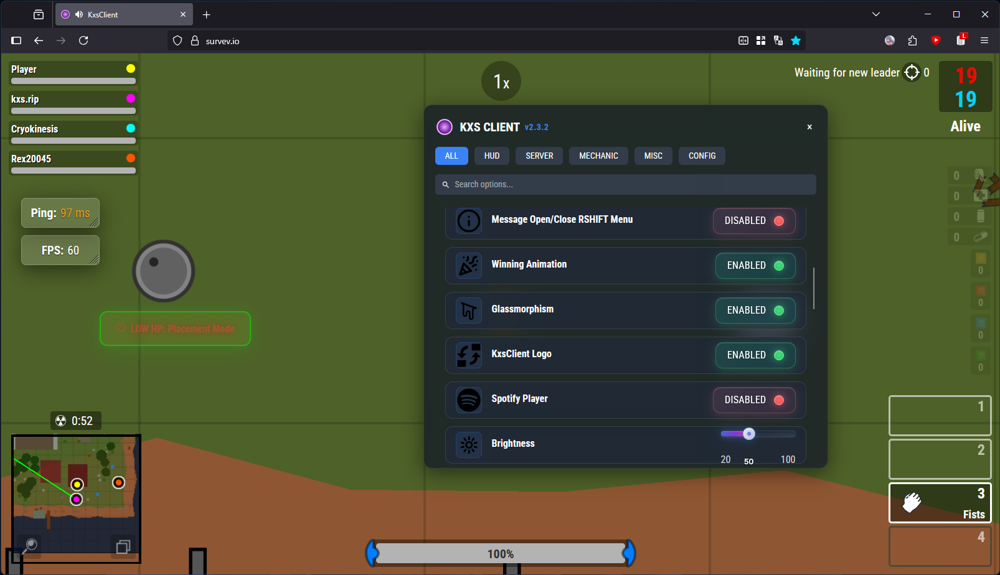

# 🎮 KxsClient

### **Rediscover Surviv.io with the Ultimate Enhancement Client**

## 📋 Overview

KxsClient (Kisakay x Surviv) is a premium-quality, free and open-source enhancement client for Surviv.io, written in TypeScript. It delivers over 30 fully configurable mods with a modern, user-friendly interface that enhances your gameplay experience without breaking the game's rules.

**Key Highlights:**
- 🎨 Modern and intuitive UI with minimalist design
- ⚙️ 30+ performance-enhancing features
- 🔊 Integrated voice chat for real-time communication
- 🌐 Multiplayer network integration
- 🔧 100% customizable HUD elements
- ✅ Completely legitimate with no unfair advantages

## 🌟 Feature Showcase

### 💬 KxsNetwork Integration

Connect with other KxsClient users in the game with our exclusive networking features:

- **Real-time Player Detection** - See when other KxsClient users join your game
- **In-game Chat System** - Communicate with other players without leaving the game
- **Voice Chat** - Talk with teammates in real-time with personal mute controls
- **Username Synchronization** - Automatic username updates across sessions

### 🛠️ Customizable Interface

  
  
<i>The elegant RSHIFT menu with all customization options</i>

- **Draggable Elements** - Position HUD elements exactly where you want them
- **Grid System** - Easily align elements with our intelligent grid system
- **Customizable Colors** - Set your own colors for various interface elements
- **Toggle Visibility** - Show or hide any UI element based on your preference

### 🎯 Performance Enhancements

- **Heal Bar Indicator** - Visual indication of healing progress
- **Kill Feed Improvements** - Enhanced kill feed with additional information
- **Performance Metrics** - Real-time FPS, ping, and other performance statistics
- **Focus Mode** - Clean interface that removes distractions during intense gameplay
- **Gun Overlay Customization** - Colored and chromatic border options

### 🌐 Discord Integration

  
  
<i>Rich presence integration with Discord</i>

- **Rich Presence** - Show your game status in Discord
- **Game Logging** - Optional Discord webhook integration for tracking your gameplay statistics
- **Automatic Notifications** - Get notified about important events through Discord

### 📊 Statistics & History

- **Kill Leader Tracking** - See who's dominating the game
- **Game History** - Review your past games and performance
- **Performance Analytics** - Track your improvement over time
- **Death Analysis** - Learn from your defeats to improve your gameplay

## 🚀 Getting Started

1. Install a userscript manager like [Tampermonkey](https://www.tampermonkey.net/)
2. Visit [kxs.rip](https://kxs.rip) and click "Install"
3. Open Surviv.io and enjoy your enhanced gaming experience!

## 🔧 Client Configuration

Access the configuration menu by pressing <kbd>Right Shift</kbd> during gameplay. From here, you can customize every aspect of KxsClient to match your preferences.

## ❓ Frequently Asked Questions

### Is KxsClient a cheat client?

**Absolutely not.** KxsClient strictly adheres to Surviv.io's rules and Terms of Service. It only enhances the user interface and adds quality-of-life features without providing any unfair advantages. You can play with complete confidence, even in competitive environments.

### How is KxsClient different from other clients?

KxsClient focuses on enhancing the visual experience and adding useful features without affecting gameplay balance. Unlike other clients that replace game files, KxsClient works alongside the game as a userscript, making it compatible with all browsers that support userscript managers.

### How can I report issues or suggest features?

Contact me on Discord (`kisakay`) or find me on the official Surviv.io Discord server. I'm always open to suggestions and feedback!

## 💖 Support the Project

KxsClient is and will always be completely free to use. If you enjoy using it, consider:

- ⭐ Starring this repository
- 🔄 Sharing it with your friends
- 🐛 Reporting bugs and issues
- 💡 Suggesting new features

## 📝 License

KxsClient is licensed under the [MIT License](LICENSE), which means you're free to use, modify, and distribute it as you wish. Contributions are always welcome!

---

**Made with ❤️ by [Kisakay](https://github.com/Kisakay)**

